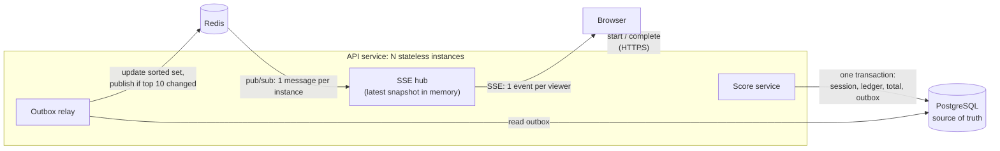
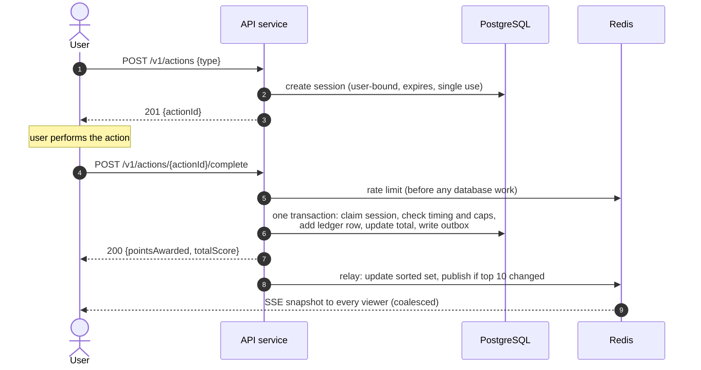

# Problem 6: Scoreboard Module Specification

A specification for the backend team: a **live top-10 scoreboard** where users raise their score by completing actions, and **nobody can raise a score without earning it**.

This page is the 5-minute overview. Implementation detail is in [`docs/`](#documentation-map), and the API contract is in [`api/openapi.yaml`](api/openapi.yaml).

## The core idea

> **The client never sends a score.** It only says "I started action X" and "I finished action X". The server decides whether that finish counts and how many points it is worth.

Every security property below follows from this rule.

Out of scope: what the action is, authentication itself (the existing access-token middleware is reused), and the admin UI for reviewing flagged users. This spec defines the data and hooks that UI needs.

## Requirements → design

| # | Requirement | How this design meets it |
|---|---|---|
| 1 | Show the top 10 scores | A Redis sorted set holds the leaderboard, built from committed database totals. Every API instance keeps the latest top-10 snapshot in memory, so reads cost nothing. |
| 2 | Live updates | **Fan-out on write:** a top-10 change is published once, Redis pub/sub delivers it to every API instance, and each instance pushes it to its viewers over **Server-Sent Events**. Events are full snapshots, at most 2 per second per viewer. Viewers see changes in under 1 s. |
| 3 | Completing an action raises the score | The points per action type are configured **on the server**. They are awarded in one PostgreSQL transaction, recorded in an append-only ledger. |
| 4 | Completion triggers an API call | `POST /v1/actions/{id}/complete`, an ordinary HTTP call that is **idempotent**, so retries are always safe |
| 5 | **Stop unauthorized score increases** | Single-use, user-bound action sessions; timing and points limits; rate limits checked before the database; abuse detection. See [below](#5-preventing-unauthorized-score-increases). |

## Architecture



<details>
<summary>Component responsibilities</summary>

| Component | Responsibility |
|---|---|
| **Auth + rate-limit middleware** | Existing JWT check, plus per-user and per-IP token buckets in Redis. Runs before any database access. |
| **Actions controller / Score service** | Starts actions and completes them. Awards points in **one PostgreSQL transaction**. |
| **Outbox relay worker** | Reads committed score changes from the outbox. Updates the Redis sorted set and publishes a new top-10 snapshot when the top 10 changed. |
| **SSE hub** | One per instance. Subscribes **once** to the Redis channel and pushes snapshots to the viewers connected to that instance. |
| **Leaderboard query** | Serves `GET /v1/leaderboard` from the SSE hub's in-memory snapshot, which is always the latest published version. It falls back to Redis, then PostgreSQL, only when the hub has no snapshot yet. |
| **Risk evaluator worker** | Scores user behavior asynchronously. Flags suspicious users and removes them from the public board ([details](docs/security.md#suspicious-activity-detection-and-response)). |

The workers run inside the API service process as background loops, so there is no new deployable. They coordinate through `FOR UPDATE SKIP LOCKED`, so running one per instance is safe.

</details>

## Score update flow



Full detail: the [transaction in SQL](docs/score-update.md#the-transaction), the [decision flow for every error case](docs/score-update.md#completion-decision), the [data model](docs/score-update.md#data-model) and the [fan-out and SSE behavior](docs/live-updates.md).

## API

| Method | Path | Auth | Purpose |
|---|---|---|---|
| `POST` | `/v1/actions` | Bearer | Start an action. Returns a server-issued `actionId`. |
| `POST` | `/v1/actions/{actionId}/complete` | Bearer | Complete it. The server decides the points. Idempotent. |
| `GET` | `/v1/leaderboard` | none | Current top 10 |
| `GET` | `/v1/leaderboard/stream` | none | Live top 10 over Server-Sent Events |

Schemas, examples and every error code are in [`api/openapi.yaml`](api/openapi.yaml).

## 5. Preventing unauthorized score increases

Each attack is blocked by a specific mechanism:

| Attack | Blocked by |
|---|---|
| Sending a made-up score | No endpoint accepts points or scores, and unknown fields are rejected |
| Calling the API without logging in, or as someone else | The user id comes **only** from the verified access token; ids in request bodies are rejected |
| Replaying a completion | Each session can be completed once (a conditional `UPDATE`, plus a unique key on the ledger). A replay gets the original response and **zero points**. |
| Sending the same completion 50 times in parallel | Only one conditional `UPDATE` can succeed. The ledger's unique key backs this up. |
| Completing someone else's action | Sessions are bound to their owner; other users' ids return 404 |
| Completing faster than humanly possible | A minimum duration per action type. Too-fast completions are rejected and flagged. |
| A script hammering the endpoints | Rate limits (per user and per IP) are checked in Redis **before the database**. Repeat offenders are blocked for escalating periods. |
| A script farming points at the allowed pace | Hourly and daily points caps limit the gain. Behavioral detection (machine-like timing, never stopping, many accounts per IP) removes the user from the public board for review. Points can be reversed exactly through the ledger. |

**What can't be guaranteed.** If the action runs entirely in the browser, the server can't prove a human did it: a scripted real client can still play within the limits. The design makes that slow, visible and reversible. The complete fix is to [verify the action on a server](#further-improvements). Details: [threat model, limits, detection rules and implementation checklist](docs/security.md).

## Reliability

PostgreSQL is the source of truth. Redis holds only data that can be rebuilt, so **an acknowledged point is never lost** and **the board is never wrong, only briefly stale**.

| If… | Then… |
|---|---|
| The process crashes after saving points | The transactional outbox publishes the change later. Nothing is lost. |
| Redis fails or slows down | A circuit breaker opens. Completions continue with local rate limits, and the board is served from memory. |
| PostgreSQL fails | Completions return 503 (safe to retry) and the board stays visible |
| Redis and PostgreSQL drift apart | Reconciliation jobs detect and repair the difference |

Timeouts, pool sizing, retries with jitter, circuit breakers, bulkheads and reconciliation are specified with concrete values in [Resilience](docs/resilience.md).

## Scaling: 100 → 1 000 → 1 000 000 viewers

| | ~100 | 1 000 – 50 000 (**v1 target**) | ~1 000 000 |
|---|---|---|---|
| Live updates | SSE + PostgreSQL `LISTEN/NOTIFY` | SSE + Redis pub/sub fan-out | Dedicated realtime gateways; a CDN-cached snapshot for anonymous viewers |
| Top 10 | SQL query on an index | Redis sorted set | Sharded sorted sets, merged |
| Writes | Synchronous transaction | Synchronous + outbox | Write-behind through Kafka |
| Redis needed? | No | Yes | Several clusters |

The API contract is the same in every tier, so clients never change. Capacity math, hot spots (very active users, the single leaderboard key, reconnect storms) and the measured triggers for moving up are in [Capacity and scaling](docs/scaling.md).

## Key decisions

| Decision | Instead of | Why |
|---|---|---|
| [Server-side single-use sessions](docs/adr/0001-server-authoritative-scoring.md) | Signed tokens, client-reported points | The database check already gives single use, ownership and expiry. A signature would add nothing. |
| [Full-snapshot fan-out over SSE](docs/adr/0002-live-updates-fan-out-sse.md) | WebSocket, polling, deltas | One-way data, plain HTTP, and no ordering or gap handling needed |
| [Ledger + outbox, Redis as a read model](docs/adr/0003-ledger-source-of-truth-redis-read-model.md) | Redis as the primary store, dual writes | No lost points, a full audit trail, exact reversals |
| [Synchronous writes first](docs/adr/0004-synchronous-writes-before-write-behind.md) | Caching writes and batch-inserting | Not needed below ~2 000 writes/s; write-behind adds a durability risk |

## Further improvements

1. **Verify actions on the server.** If the action can run on, or be checked by, a server (a game server, a server-graded quiz, a payment provider), that service should report completion directly with a signed event, and the public completion endpoint goes away. This is the only complete answer to scripted clients.
2. **Device attestation** on mobile (Play Integrity, App Attest).
3. **Challenges instead of silent exclusion:** a CAPTCHA for flagged users, so real users can clear themselves.
4. **Detection models** trained on reviewed cases. The ledger is already the training data.
5. **Weekly or seasonal boards:** one sorted-set key per period. These also limit how long a cheat stays visible.

## Open questions for product

1. Ties: is "first to reach the score ranks higher" right?
2. Can anonymous visitors see the board? Should users see their own rank outside the top 10?
3. Do the default limits fit the real action: 600 points/hour, 3 000/day, a 7-day account age to appear in the top 10?
4. Should flagged users be told, or silently excluded from the board?
5. All-time board, or one that resets weekly or by season?

## Documentation map

| Document | For |
|---|---|
| [docs/score-update.md](docs/score-update.md) | The completion transaction, error decision flow, data model, session states |
| [docs/live-updates.md](docs/live-updates.md) | Fan-out model, SSE behavior, coalescing, building the top 10, ties |
| [docs/security.md](docs/security.md) | Threat model, rate limits, repeated requests, abuse detection, implementation checklist |
| [docs/resilience.md](docs/resilience.md) | Timeouts, pools, retries, circuit breakers, bulkheads, failure modes, reconciliation |
| [docs/scaling.md](docs/scaling.md) | Assumptions, capacity estimate, the three tiers, hot spots, write-behind |
| [docs/operations.md](docs/operations.md) | Configuration and observability (metrics, alerts) |
| [docs/delivery.md](docs/delivery.md) | 25 acceptance criteria and the step-by-step implementation plan |
| [docs/adr/](docs/adr/) | Architecture Decision Records: context, alternatives, consequences |
| [api/openapi.yaml](api/openapi.yaml) | The API contract (OpenAPI 3.1) |

## Validating this spec

```bash
npm install
npm test        # OpenAPI lint (strict, examples checked against schemas), Mermaid render check, Markdown lint
```

CI ([`.github/workflows/ci.yml`](.github/workflows/ci.yml)) runs these checks and verifies every link and anchor. The workflow treats this folder as the repository root.
