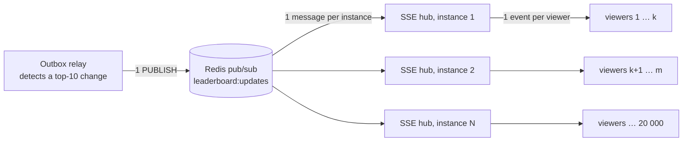
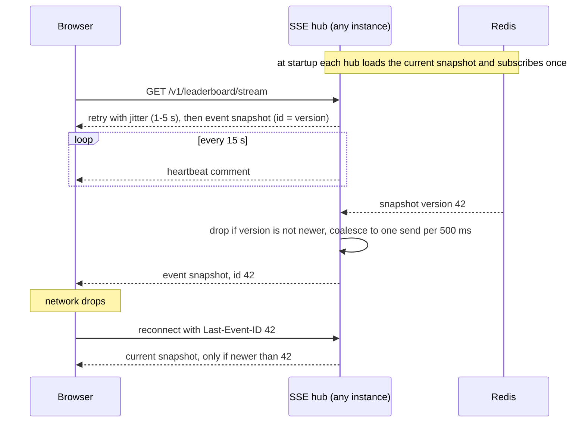

# Live leaderboard updates

*Part of the [scoreboard module specification](../README.md).*

## Model: two-level fan-out on write

When the top 10 changes, the system computes the new snapshot **once** and pushes it to everyone. This is fan-out on write:

- **Redis cost scales with the number of instances, not viewers.** Each instance subscribes once, whether it has 10 viewers or 10 000.
- **Viewers do no work.** The snapshot already contains ranks and display names.
- **The event is a full snapshot, not a delta.** At most 10 rows, under 1 KB. A client that misses a message just takes the next one, so there's no replay or ordering logic. Every snapshot carries a `version` (a Redis `INCR`), and hubs drop any snapshot older than the one they already hold.
- **Coalescing stops update storms.** Each hub keeps only the latest snapshot and sends to its viewers at most once every 500 ms: the first change goes out immediately, and anything during the next 500 ms is merged into one follow-up. However busy the top of the board gets, each viewer receives at most 2 events per second.
- **Most score updates never reach Redis pub/sub.** The relay first checks whether the new score is at least the current 10th score. Only then does it rebuild the top 10. It publishes only if the ordered list actually changed.

## Why SSE

The board only flows from server to client, so **Server-Sent Events** fit: plain HTTP, the browser reconnects on its own with `Last-Event-ID`, it passes through proxies, and it needs no extra protocol layer. Score submissions stay on ordinary HTTP endpoints, which keeps status codes, middleware, rate limiting and retries simple. If the product already runs WebSockets for other features, the hub can publish the same snapshot event over that channel; the fan-out design doesn't change. See [ADR-0002](adr/0002-live-updates-fan-out-sse.md).

## Stream behavior

Infrastructure requirements:

- Turn off response buffering on the proxy (send `X-Accel-Buffering: no`).
- Set the load balancer's idle timeout above the 15-second heartbeat.
- Serve over HTTP/2, so browsers aren't limited to 6 connections per host.

Connection limits:

- At most 5 streams per IP, enforced in Redis.
- A configurable maximum per instance (default 10 000). Above it, return `429 too_many_connections` and the client retries with backoff.
- Slow clients whose socket buffer is full are skipped for that send, since only the latest snapshot matters. Clients still stuck after 30 seconds are disconnected.

## Building the top 10

- **Redis sorted set** `lb:alltime`: the member is the user id, the score is the total score. Written **only** from committed database values with `ZADD … GT`. This is idempotent (replaying an outbox row changes nothing) and safe when messages arrive out of order (a stale, lower value never overwrites a newer one). `ZINCRBY` is deliberately not used, because it isn't idempotent.
- **Ties:** the user who reached the score first ranks higher. The relay reads the top 10 plus every member tied with the 10th (`ZREVRANGEBYSCORE`), then orders by `(score DESC, reached_at ASC)` using `user_scores`.
- **Display names** are cached in a Redis hash, and invalidated when a user renames.
- **Each hub keeps the latest snapshot in memory.** That copy serves `GET /v1/leaderboard`, the first event of every new stream, and reconnects, so reads never fan back into Redis or PostgreSQL.
- **Publish-if-changed** is one Lua script: compare the hash of the new ordered top 10 with the last published hash; if different, store the new hash, `INCR` the version and `PUBLISH`, all atomically. Several relay workers therefore can't publish out of order or publish duplicates.
