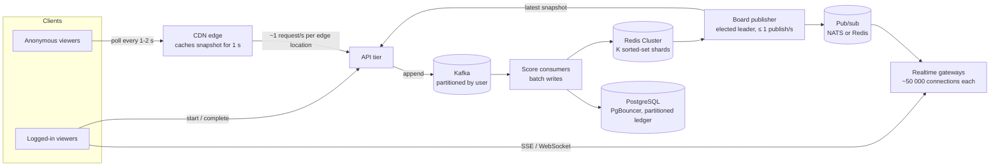

# Capacity and scaling

*Part of the [scoreboard module specification](../README.md).*

## Assumptions and design targets

Assumptions. Confirm them with product before sizing infrastructure (see [Open questions for product](../README.md#open-questions-for-product)):

- Users are already authenticated with short-lived bearer access tokens (JWT). The user id is the token's `sub`.
- There is one **all-time** leaderboard. Anyone, including anonymous visitors, can view the top 10.
- Each action type is worth a fixed number of points, set on the server per action type.
- Infrastructure: several stateless API instances behind a load balancer, **PostgreSQL** as the primary database, and **Redis**.

Targets. These drive the design choices below; validate them with a load test (see [Implementation plan](delivery.md#implementation-plan)):

| Metric | Target |
|---|---|
| Score updates | 200/s sustained, 1 000/s burst |
| Concurrent leaderboard viewers | 20 000 |
| Completion endpoint latency | p99 < 150 ms |
| Time from a score change to viewers' screens | p95 < 1 s |
| Leaderboard availability | 99.9%. Viewers may see a slightly stale board during incidents, but never a wrong one (see [Resilience and failure handling](resilience.md)). |
| Lost points after a success response | Zero. A success response means the points are committed to PostgreSQL. |

### Capacity estimate

| Resource | Estimate at target load | Conclusion |
|---|---|---|
| PostgreSQL writes | 1 000 completions/s burst × 1 transaction (5 short statements) | Well within a single primary (thousands of transactions/s). No sharding. |
| Ledger growth | ~100 B per `score_events` row. At an average of 50/s: ~4.3 M rows/day, ~0.5 GB/day | Partition `score_events` by month. Keep 13 months online, archive older ones. |
| Redis | ~1 000 `ZADD`/s + ~2 000 rate-limit calls/s + ≤ 5 publishes/s | A single Redis node handles 100 000+ ops/s, so the load is < 5%. |
| SSE connections | 20 000 concurrent, ~10 000 per instance comfortably | At least 2 instances; run 4 for headroom and rolling deploys. |
| SSE bandwidth | Worst case 20 000 viewers × 2 events/s × ~1 KB ≈ 40 MB/s across the fleet. Only while the top 10 changes constantly. | Acceptable. A quiet board sends only 15-second heartbeats. |
| Leaderboard reads | Served from each instance's in-memory snapshot | Zero Redis or database reads per request (see [Hot spots](#hot-spots)) |

## Scaling: 100 → 1 000 → 1 000 000

### Three tiers

"Scale" here means **concurrent viewers** and **score updates per second**. The number of registered users matters much less: a sorted set of 1 million members is small for Redis, so 1 M registered users still fits tier M.

| | Tier S: ~100 viewers | Tier M: 1 000–50 000 viewers (**this spec**) | Tier L: ~1 000 000 viewers |
|---|---|---|---|
| Score updates | ~10/s | 200/s, bursts of 1 000/s | 10 000–50 000/s |
| Deployment | 2 API instances (for availability) | 4–10 API instances | API tier, plus a separate realtime gateway tier |
| Live transport | SSE from the API | SSE from the API (see [Live leaderboard updates](live-updates.md)) | Logged-in viewers: SSE or WebSocket through gateways. Anonymous viewers: snapshot polled from a CDN every 1–2 s. |
| Fan-out | PostgreSQL `LISTEN/NOTIFY` to each instance | Redis pub/sub → instance hubs → viewers | Board publisher → sharded pub/sub (NATS or Redis Cluster) → regional gateways → viewers. The CDN absorbs anonymous reads. |
| Top-10 computation | SQL `ORDER BY score DESC, reached_at LIMIT 10` on an index, after each change (debounced 500 ms) | Redis sorted set + publish-if-changed | Sorted set split into K shards with scatter-gather top-K. One elected board publisher, at most 1 publish/s. |
| Write path | Synchronous transaction | Synchronous transaction + outbox | Write-behind through Kafka (partitioned by user id) or Redis Streams (10.3, ADR-0004) |
| Database | One PostgreSQL | One PostgreSQL primary, ledger partitioned by month | PgBouncer; `user_scores` sharded by user id (for example Citus) if one primary isn't enough |
| Rate limiting | In process | Redis token buckets | Edge (WAF, bot management) + a dedicated Redis cluster for limits |
| Abuse detection | Rules + manual review | Rules + risk scoring (see [Suspicious activity: detection and response](security.md#suspicious-activity-detection-and-response)) | Streaming detection (Kafka Streams or Flink) + trained models |
| Redis needed? | **No**: fewer moving parts | Yes | Yes, as several clusters |

**What stays the same in every tier:** the API contract, server-side scoring, idempotent completions, full-snapshot events, and PostgreSQL as the source of truth. Moving up a tier changes the internals, never the clients.

Tier L architecture:

Tier L numbers:

- **Bandwidth.** 1 M viewers × 1 event/s × ~400 B (gzip) ≈ **400 MB/s**. Serving that from origin servers is expensive; serving it from CDN edges and gateways spreads it out. This is why anonymous viewers poll a CDN-cached snapshot: the origin sees about one request per second per edge location, whatever the audience size.
- **Connections.** At ~50 000 connections per gateway node (with tuned file descriptor limits and kernel settings), 1 M connections need about 20–30 nodes including headroom. A managed service (Ably, Pusher) or a self-hosted gateway (Centrifugo) is a reasonable buy-versus-build choice here.
- **Multiple regions.** Each region accepts writes for its users and keeps its own top K. A global publisher merges the regional top lists into the global top 10.

**Triggers for moving up.** Each is measured, not guessed:

| Measured signal | Change |
|---|---|
| > 50 000 viewers, or broadcast CPU dominating instances | Move streams to a dedicated gateway tier |
| Leaderboard reads dominating | CDN in front of `GET /v1/leaderboard` (`max-age=1`) |
| `ZADD` latency or CPU on the leaderboard shard rising | Split the sorted set (see [Hot spots](#hot-spots)) |
| PostgreSQL connections near 70% of `max_connections` | PgBouncer in transaction mode |
| PostgreSQL write latency rising at > 2 000 score updates/s | Write-behind (see [Write path at very high volume](#write-path-at-very-high-volume)) |
| Seasonal or regional boards | One sorted set per board (`lb:2026-w41`, `lb:eu`). The same code with a different key. |

### Hot spots

Load is never spread evenly. A few users, a few keys and a few moments carry most of it. These are the hot spots in this design and how each one is bounded:

| Hot spot | Why it's hot | How it's bounded | Plan if it grows |
|---|---|---|---|
| **A very active user** (writes) | All of one user's completions lock the same `user_scores` row | The completion rate limit caps one user at 30/min (0.5/s). A row lock is held for ~2 ms, so one row can absorb ~500 completions/s: **about 1 000× headroom**. | If an action type legitimately needs many completions per second (clicker-style), add up that user's points in Redis over a 1-second window and commit them as one ledger row per window. The single-use claim is kept per action. |
| **Very active users in the top 10** | Every score change of a top-10 user changes the board and triggers a publish | ≤ 10 users × 0.5/s = **≤ 5 publishes/s**, because of the rate limit. Each hub sends at most 2 events/s per viewer regardless (see [Model: two-level fan-out on write](live-updates.md#model-two-level-fan-out-on-write)). | Add a relay-side debounce (publish at most every 200 ms, merging the changes in between) if publishes ever exceed ~20/s |
| **The `lb:alltime` key** | One sorted set lives on one Redis shard; every score change writes to it | ~1 000 `ZADD`/s (O(log n), microseconds each) against a node that handles 100 000+ ops/s | **Split the board into K sorted sets** by `hash(userId) mod K`, each on a different shard. Read the top 10 of each and merge them (scatter-gather top-K: K × 10 entries). The publish-if-changed step runs on the merged result. |
| **Leaderboard reads** | Every page load asks for the same 10 rows | Served from each instance's **in-memory snapshot** (the hub already holds the latest version), so there are no Redis or database reads per request. Responses carry an `ETag` (the version) for 304s. | Put it behind a CDN with `Cache-Control: max-age=1`. The origin then sees about 1 request per second per edge, regardless of traffic. |
| **Reconnect storm** | An instance restarts or a deploy rolls; thousands of streams reconnect in the same second | Each stream gets a random `retry` of 1–5 s, spreading reconnections out. The new snapshot comes from memory, with no database work. Instances drain connections gradually during deploys. | Raise the jitter window as the number of viewers grows |
| **Attack traffic** | A script or botnet concentrates load on one endpoint | Rejected at the edge and in Redis token buckets before any database work (see [Layered rate limits](security.md#layered-rate-limits)). Blocked users cost one Redis lookup. | WAF rules, bot management at the edge |

The important property: **every hot path is bounded by a limit that is part of the design** (rate limits, coalescing, in-memory snapshots), not by hoping traffic stays low.

### Write path at very high volume

**Write-behind, done safely.** Suggested in review: accept completions into a cache and batch-insert them into the database. This raises write throughput, but a plain cache would lose acknowledged points if Redis failed, and would make Redis a second source of truth. If it becomes necessary, use this shape:

1. A Lua script in Redis does the single-use claim (`SET action:{id} NX`), the caps check, `ZADD`, and `XADD` to a **Redis Stream**, all atomically. Run Redis with AOF `appendfsync everysec` or stricter.
2. A consumer group reads the stream and batch-inserts into `score_events` and `user_scores` with `ON CONFLICT (action_id) DO NOTHING`, so retries are idempotent. It acknowledges (`XACK`) only after commit.
3. The reconciliation job becomes mandatory, because Redis now leads the database.

The trade-offs: a durability window of up to about 1 second of acknowledged points if Redis loses data, a more complex audit trail, and harder operations. That is why this is **not** the v1 design. See [ADR-0004](adr/0004-synchronous-writes-before-write-behind.md).
