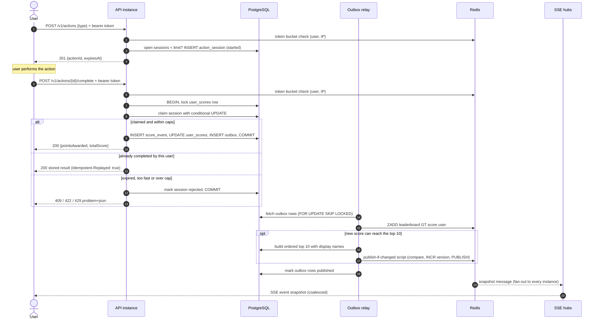
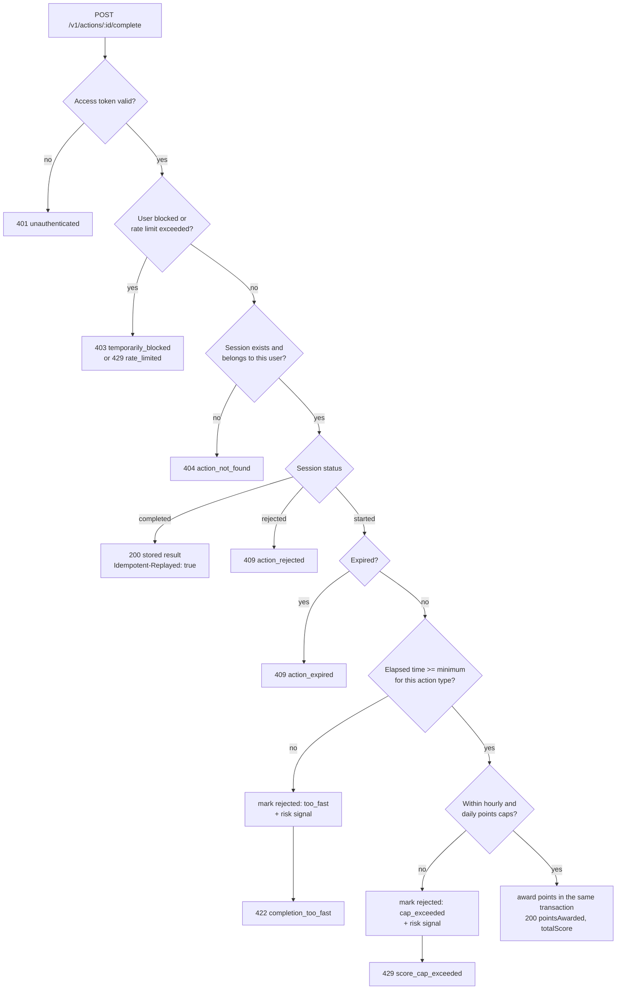
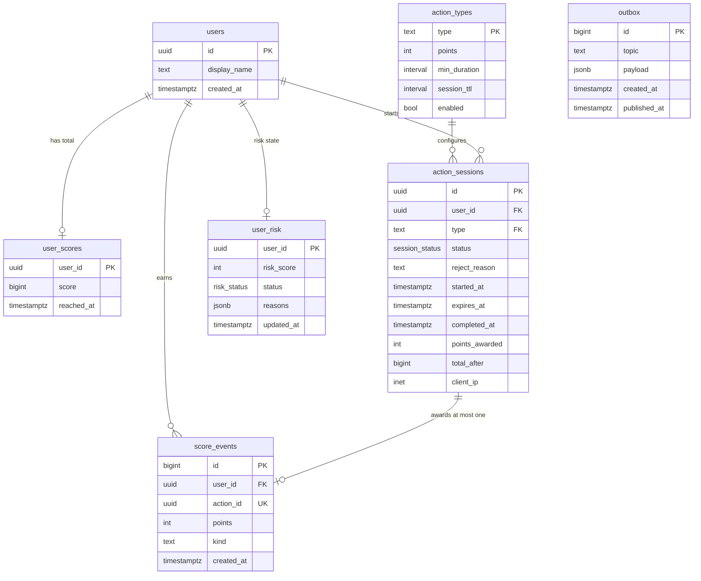
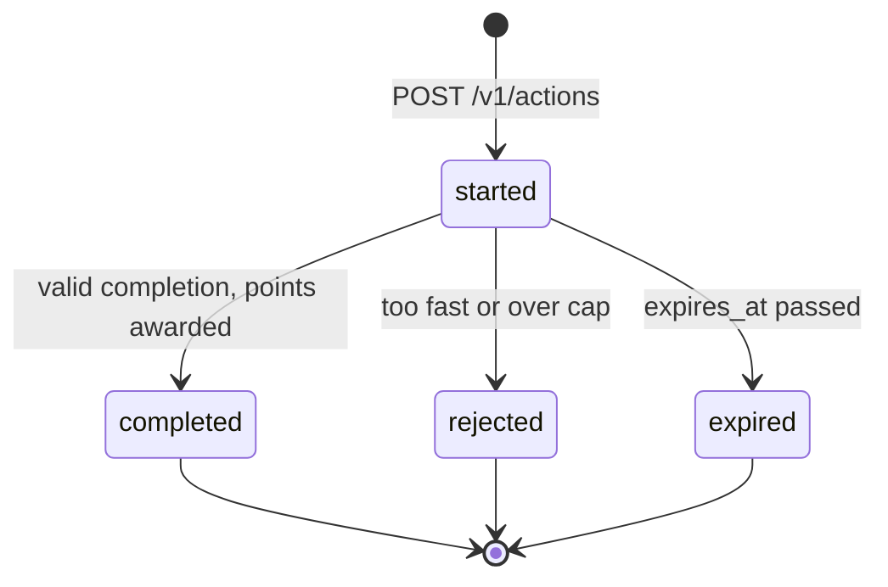

# Score update flow and data model

*Part of the [scoreboard module specification](../README.md).*

## Score update flow

### Sequence



### Completion decision

The order matters. The cheap checks that need no database run first, and every check that changes state runs inside the transaction.



### Error codes

Errors use RFC 9457 `application/problem+json`, with a stable machine-readable `code`:

| Status | `code` | Meaning |
|---|---|---|
| 400 | `invalid_request` | Invalid body. Unknown fields such as `points` or `score` are rejected. |
| 401 | `unauthenticated` | Missing or invalid access token |
| 403 | `temporarily_blocked` | The user is blocked for repeated violations. `Retry-After` says for how long. |
| 404 | `action_not_found` | No such action **for this user**. Other users' actions also return 404, so ids can't be probed. |
| 409 | `action_expired` / `action_rejected` | The action can no longer be completed |
| 422 | `action_type_unknown` / `completion_too_fast` | Unknown action type, or completed faster than humanly possible |
| 429 | `rate_limited` / `too_many_open_actions` / `score_cap_exceeded` / `too_many_connections` | Request rate, open-session, points or stream-connection limit hit. `Retry-After` is included. |
| 503 | `service_unavailable` | PostgreSQL is unavailable, the request deadline passed, or the instance is shedding load. Nothing was changed; retry with backoff. |

### The transaction

Everything that awards points happens in **one** PostgreSQL transaction, so the five steps succeed or fail together:

```sql
BEGIN;

-- 1. Serialize this user's completions so the caps below are exact. Different users never wait on each other.
--    The user_scores row is created with score 0 the first time the user starts an action.
SELECT score FROM user_scores WHERE user_id = $user FOR UPDATE;

-- 2. Claim the session. Only one request can win: single use, owner-bound, unexpired, plausible duration.
UPDATE action_sessions s
SET    status = 'completed', completed_at = now(), points_awarded = t.points
FROM   action_types t
WHERE  s.id = $action AND s.user_id = $user AND s.type = t.type
  AND  s.status = 'started' AND s.expires_at > now()
  AND  now() - s.started_at >= t.min_duration
RETURNING t.points;
-- No row: read the session to choose 200 replay / 404 / 409 / 422 (see [Completion decision](#completion-decision)).
-- A too-fast attempt is marked 'rejected' in this same transaction and then committed.

-- 3. Points caps: sum over at most a few dozen rows, using the (user_id, created_at) index.
SELECT coalesce(sum(points), 0) FROM score_events
WHERE  user_id = $user AND created_at > now() - interval '1 hour';   -- and the same for 24 hours

-- 4. Ledger entry. The UNIQUE constraint on action_id is a second guarantee against double counting.
INSERT INTO score_events (user_id, action_id, points) VALUES ($user, $action, $points);

-- 5. New total, stored on the session too so replays return the identical response. Then the outbox row.
UPDATE user_scores SET score = score + $points, reached_at = now() WHERE user_id = $user RETURNING score;
UPDATE action_sessions SET total_after = $score WHERE id = $action;
INSERT INTO outbox (topic, payload) VALUES ('score.changed', '{"userId": …, "score": …, "reachedAt": …}');

COMMIT;
```

**Why lock the `user_scores` row?** Without it, two simultaneous completions by the same user could both read "under the cap" and both commit. Locking one row per user makes the caps exact. It costs nothing in practice, because only completions by the *same* user wait for each other.

## Data model



| Table | Notes |
|---|---|
| `action_sessions` | `status`: `started`, `completed` or `rejected`. Expiry is computed from `expires_at`; a cleanup job deletes sessions older than 30 days. Indexes: `(user_id, status)` for the open-session limit, `(expires_at)`. |
| `score_events` | **Append-only ledger** and the audit trail. `kind`: `award` or `reversal`. Reversals are negative rows that point at the original, so totals can always be recomputed exactly. `UNIQUE (action_id)` (ignoring reversal rows); index `(user_id, created_at)`. |
| `user_scores` | The current total, derived from the ledger. Index `(score DESC, reached_at ASC)` serves the database fallback for the top 10. |
| `user_risk` | `status`: `ok`, `under_review` or `suspended`. Only `ok` users are present in the public sorted set. |
| `outbox` | Transactional outbox. Partial index on `published_at IS NULL`. Published rows are deleted after 7 days. |


